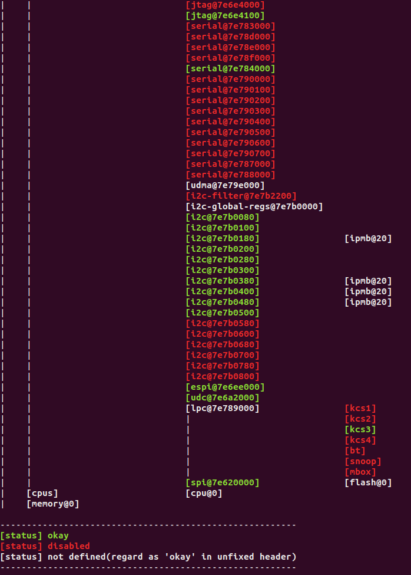

# DT_ZEPHYR
Device tree tool for zephyr.
### Purpose:
    Fast way to access devicetree integrated info in Zephyr.
    If you got any advice or requirement, please feel free to contact me with feedback.

### First rlease date:
    2021.09.03

### Version: 
- 1.0 - First commit - 2021/09/03
  - Feature: none
- 1.1 - Minor update - 2021/09/17
  - Feature:
		1. Change command 5 to 7, and add new command to 5, which new command is "Print certain node section in dt unfixed file via node_id".
		2. Add new command 6, which could instantly filter out certain node's section with given node's name. Note that command supports capital regardless.
	- Bug:
		1. Fix error info bug in nodes with same name "ipmb@20" but different path.
		2. Fix color error in command 0 0.

### Required:
- OS
  - Linux: support
  - Windows: not support
- Config file(config.txt)
  - DTS_FILE_PATH    	: */Zephyr.dts
  - DT_UNFIXED_FILE_PATH	: */devicetree_unfixed.h
  - YAML_SEARCH_PATH	: */dts/bindings

    Note: Given path should be absolute path!

### Usage:
Standard command format: <code_name> <command> <arg1> <arg2> ...
  - Linux:
	  - Print all nodes                                             	--> ./dt_read
          - Print diagram of device tree                   		--> ./dt_read 0 0
          - Display dts file                                           	--> ./dt_read 0 1
          - Display dt unfixed file                                     	--> ./dt_read 0 2
          - Print certain nodes with given node ord                    	--> ./dt_read 1 <node_ord>
          - Print certain nodes with given node name keyword            	--> ./dt_read 2 <node_name_keyword>
          - Print certain nodes with given node compat keyword          	--> ./dt_read 3 <node_compat_keyword>
          - Print certain content with given keyword in dt unfixed file 	--> ./dt_read 4 <keyword>
	  - Print certain section with given node id in dt unfixed file   --> ./dt_read 5 <node_id>
	  - Print certain section with given node name in dt file         --> ./dt_read 6 <node_name>
	  - Display certain yaml file with given keyword in binding dir   --> ./dt_read 7 <file_name_keyword>"
	  - List every yaml files in binding dir                          --> ./dt_read 7 all
  - Windows:
	  - Print all nodes                                             	--> dt_read
          - Print diagram of device tree                   		--> dt_read 0 0
          - Display dts file                                           	--> dt_read 0 1
          - Display dt unfixed file                                     	--> dt_read 0 2
          - Print certain nodes with given node ord                    	--> dt_read 1 <node_ord>
          - Print certain nodes with given node name keyword            	--> dt_read 2 <node_name_keyword>
          - Print certain nodes with given node compat keyword          	--> dt_read 3 <node_compat_keyword>
          - Print certain content with given keyword in dt unfixed file 	--> dt_read 4 <keyword>
	  - Print certain section with given node id in dt unfixed file   --> dt_read 5 <node_id>
	  - Print certain section with given node name in dt file         --> dt_read 6 <node_name>
	  - Display certain yaml file with given keyword in binding dir   --> dt_read 7 <file_name_keyword>"
	  - List every yaml files in binding dir                          --> dt_read 7 all

### Note:
    1. You could check your command version in help info.
    2. Not guarantee to support devicetree relative files on other platforms!
    3. Only support below node elements for current version:
       |ord|stat|path|id|label|name|compat|reg|interrupts|p_label|
    4. Color print only support on Linux.
    5. Keyword means one string include in target string, ex: "i2c@" in "i2c@7e7b0080".
- Demo video: https://drive.google.com/file/d/1O06qEt57HWk0j_NnVm9UpIB6rx9UJFHW/view?usp=sharing
- Command 0 demo:

